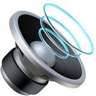

<br>

# YouTube Music Chorus

**YT Music Chorus** is a Chrome Extension that enhances your YouTube Music experience with additional features.

## ⚠️ Warning

This extension uses Chrome Developer Tools protocol to execute scripts as Google doesn't allow executing scripts on the target context since manifest v3.

## Features

- **Chorus Detection**: Detects the chorus of a song and plays the chorus only.
- Jumps to next song after chorus is played automatically.
- **Tolerance** is seconds to add detected chorus timestamp. Default is 0 seconds, (min = -30, max = 30)
- **Chorus Duration** is duration chorus. Default is 60 seconds, (min = 30, max = 90)

## Installation

1. Clone the repository:

```bash
git clone https://github.com/yourusername/yt-music-chorus.git
```

2. Load the extension in Chrome:
   - Open Chrome and go to `chrome://extensions/`
   - Enable "Developer mode"
   - Click "Load unpacked" and select the repository directory

## Usage

1. Open YouTube Music desktop app or website.
2. The extension will automatically detect the chorus of the song and play the chorus only.

## Contact

For any questions or feedback, please contact us at [erencelik.xyz](https://erencelik.xyz).

## License

This project is licensed under the MIT License. See the [LICENSE](LICENSE) file for details.
